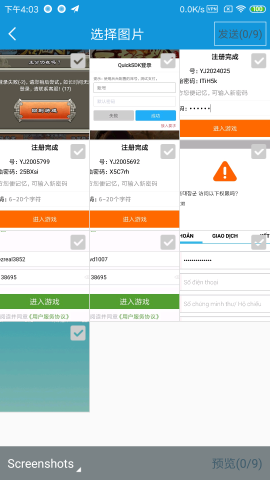

# EzChat
基于网易云信 IM SDK for Android，界面仿造QQ和微信，打造的一款简单的即时通讯 APP

项目封装了
公用工具类组件：commonLibrary 

Emoji表情包控件:emojiLibrary

多图片选择预览控件:photoselector

起止时间选择器:timeselectview

以及防微信的 点击拍照长按录像的 camera ，长按录音，松开发送，上滑取消的录音 button 等

目前实现的功能：用户注册，登陆，个人资料修改，点对点聊天
目前实现聊天中，可发送文本，表情，语音，图片，视频以及位置信息

APP 还有很多功能正在完善中~~

 APP 部分界面截图：

注册

登陆

主页-联系人

主页-最近会话

个人信息

点对点聊天

表情包控件

聊天扩展

位置信息发送

多图片选择

点击拍照 长按录像

相机预览

